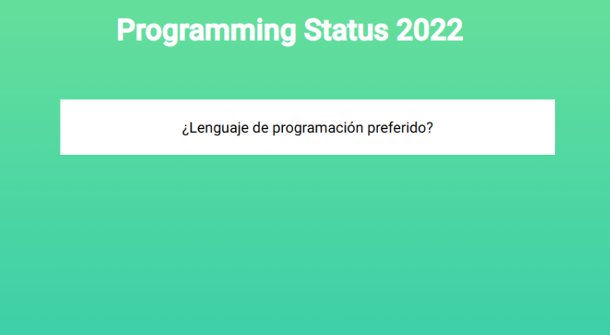

# Django Polls

Django polls it's a basic application for make a basic polls.

## Starting App

```bash
 python manage.py runserver
```
## Documentation
For build an app like this you can follow official django tutorial [here](https://docs.djangoproject.com/en/4.0/intro/tutorial01/)

